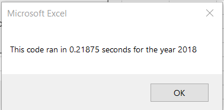
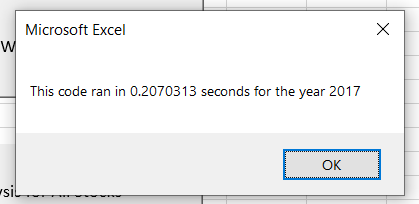
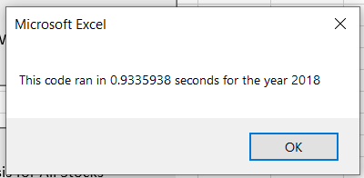
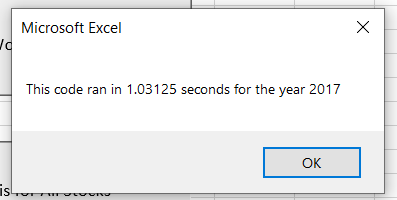

# stock-analysis

## Overview of Project

### Purpose

Steve is analyzing stock market data for his parents to help them in choosing stocks that will perform well and lead to a high overall return. They are specifically looking in the renewal energy market, and Steve is trying to find alternatives to the DAQO stock they currently have as there are better options to produce a higher return on their investment. Steve wants to use the workbook we have already given him and expand its capacity to be able to include the entire stock market in the analysis. We will need to optimize the workbook using refactoring so it can more efficiently handle large amounts of data. 

## Results

### 2018 vs 2017 Stock Performance

Overall stock performance based on a percentage return was much lower in 2018 than 2017. Majority of stocks in 2018 (12/14 stocks chosen) had a negative return, where as only one stock in 2017 had a negative return. However, in 2018 there was a higher daily volume when looking at all stocks together. 

### Efficiency & Optimization of Original vs Refactored Script

After refactoring the VBA script we found that speed of the macro dramatically increased. The macro went from taking 0.93 seconds to 0.22 seconds for 2018 and 1.03 seconds to 0.21 seconds for 2017. See below for example comparison screenshots. This implies that the refactored macro is going to be much more efficient and quicker, especially when handling larger sets of data. 

Refactored 2018

Refactored 2017

Original 2018

Original 2017

- Code 

Some of the code is similar between the original and the refactored version. I have copy and pasted some areas where it was different between the two. One of the big differences is that the refactored code uses multiple arrays. 

  - Refactored Code: 

'  '1a) Create a ticker Index
    Dim tickerIndex As Long
    tickerIndex = 0

    '1b) Create three output arrays
    Dim tickerVolumes(12) As Long
    Dim tickerStartingPrices(12) As Single
    Dim tickerEndingPrices(12) As Single
    
    ''2a) Create a for loop to initialize the tickerVolumes to zero.
    For i = 0 To 11
        tickerVolumes(i) = 0
    Next i
    ''2b) Loop over all the rows in the spreadsheet.
    For i = 2 To RowCount
        
        '3a) Increase volume for current ticker
        
        tickerVolumes(tickerIndex) = tickerVolumes(tickerIndex) + Cells(i, 8).Value
        
        '3b) Check if the current row is the first row with the selected tickerIndex.
        If Cells(i - 1, 1).Value <> tickers(tickerIndex) Then
            
            tickerStartingPrices(tickerIndex) = Cells(i, 6).Value
            
        End If
        
        '3c) check if the current row is the last row with the selected ticker
         'If the next row’s ticker doesn’t match, increase the tickerIndex.
        If Cells(i + 1, 1).Value <> tickers(tickerIndex) Then
            
            tickerEndingPrices(tickerIndex) = Cells(i, 6).Value
            

            '3d Increase the tickerIndex.
            
            tickerIndex = tickerIndex + 1
            
        End If
    
    Next i
    
    '4) Loop through your arrays to output the Ticker, Total Daily Volume, and Return.
    For i = 0 To 11
        
        Worksheets("All Stocks Analysis").Activate
        tickerIndex = i
        Cells(i + 4, 1).Value = tickers(tickerIndex)
        Cells(i + 4, 2).Value = tickerVolumes(tickerIndex)
        Cells(i + 4, 3).Value = tickerEndingPrices(tickerIndex) / tickerStartingPrices(tickerIndex) - 1
        
    Next i'
    
 - Original Code: 
   
   ''3a) Initialize variables for starting price and ending price
    Dim startingPrice As Single
    Dim endingPrice As Single
    
    '3b) Activate data worksheet
    Worksheets(yearValue).Activate
    
    '3c) Get the number of rows to loop over
    RowCount = Cells(Rows.Count, "A").End(xlUp).Row
    
    '4) Loop through tickers
    For i = 0 To 11
    ticker = tickers(i)
    totalVolume = 0
    
        '5) Loop through rows in the data
        Worksheets(yearValue).Activate
        For j = 2 To RowCount
    
            '5a) get total volume for current ticker
            If Cells(j, 1).Value = ticker Then
    
                totalVolume = totalVolume + Cells(j, 8).Value
    
             End If
    
            '5b) get starting price for current ticker
            If Cells(j - 1, 1).Value <> ticker And Cells(j, 1).Value = ticker Then
        
                startingPrice = Cells(j, 6).Value
    
             End If
    
            '5c) get ending price for current ticker
            If Cells(j + 1, 1).Value <> ticker And Cells(j, 1).Value = ticker Then
        
                endingPrice = Cells(j, 6).Value
        
            End If
    
        Next j

        '6) Output data for current ticker
        Worksheets("All Stocks Analysis").Activate
        Cells(4 + i, 1).Value = ticker
        Cells(4 + i, 2).Value = totalVolume
        Cells(4 + i, 3).Value = endingPrice / startingPrice - 1
    
    Next i'

## Summary

### Advantages & Disadvantages to refactoring code

- What are the advantages or disadvantages of refactoring code?

  - Advantages:
     -  One of the main advantages is that refactoring improves efficiency, so the macros will run faster. Another advantage is that it makes the code easier to read and understand. This becomes very useful if many other people will be looking at your code in the future. May reduce debugging time if changes were made.  
  
  - Disadvantages:
    - One disadvantage to refactoring code could be that it takes extra time to develop the new refactored code on top of the time it took you to produce the first macro, so this could be a hit to productivity in the short term. Additionally, a disadvantage could be that members of your team got used to the macro before it was refactored and don't know how to interpret it after refactoring. 

- How do these pros and cons apply to refactoring the original VBA script? 

  - In this case we saw that the pros to refactoring the original script were that macro runtime was greatly reduced. This will also allow the workbook to be easily expanded to include the whole stock market. One disadvantage was that we had to take extra time to build on an already working macro. 
